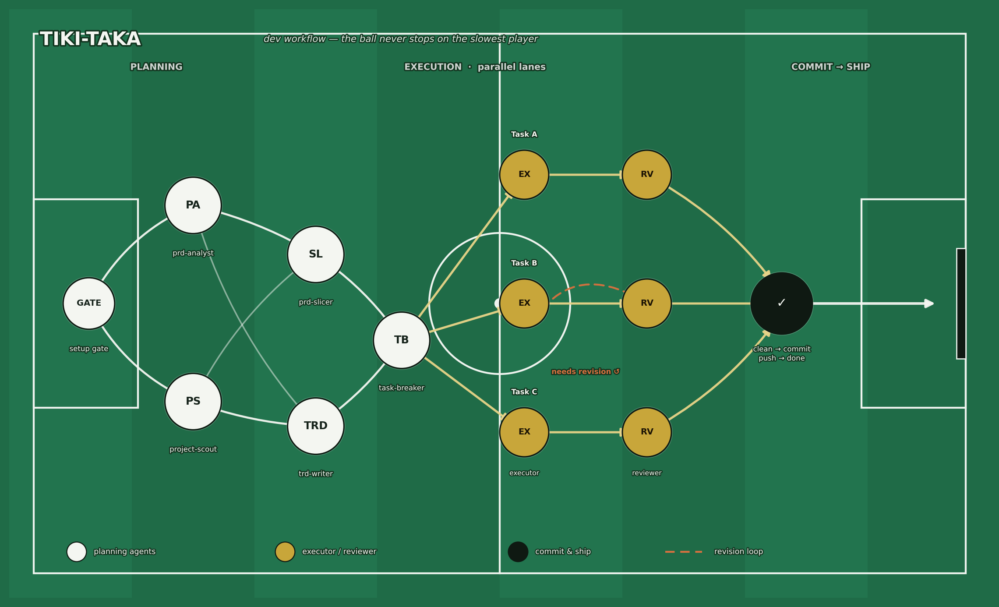

# tiki-taka

A PRD-to-ship development workflow orchestrator for any software team. It runs a critical-thinking
planning pipeline (challenge the PRD, slice by technical dependency, write a TRD, break into tasks)
and a parallel execute→review barrier loop with contract-first dependency handling. It supports
**Claude Code and Codex** from the same workflow source: Claude Code uses explicit slash commands,
while Codex uses explicit workflow skills. The large orchestration workflows do not auto-trigger for
ordinary coding requests.

Team-agnostic: nothing is hardcoded to a specific squad, and it works with whatever issue
tracker / wiki you use (JIRA, Linear, GitHub Issues, Confluence, Notion, or plain `.md` files).
The agent and skill `.md` files are model-agnostic — usable by any coding assistant that reads
markdown agents/skills, not only Claude.

<p align="center">
  
  <br>
  <em>
    The workflow as a coach's tactic board. <strong>Build-up (planning):</strong> the setup gate
    passes to <code>prd-analyst</code> + <code>project-scout</code> in parallel, up through
    <code>prd-slicer</code> / <code>trd-writer</code> to the <code>task-breaker</code> playmaker.
    <strong>Attack (execution):</strong> through-balls to three parallel task lanes, each
    <code>executor → reviewer</code>; Task&nbsp;B shows the dashed revision loop back-pass.
    <strong>Finish:</strong> every lane arrives at <code>clean → commit → push → done</code> and
    shoots — the ball never stops on the slowest player.
  </em>
</p>

## Commands

| Command                     | Function                                                                                                                                                                                                         |
| --------------------------- | ---------------------------------------------------------------------------------------------------------------------------------------------------------------------------------------------------------------- |
| `/tiki-taka:setup-workflow`   | Configure the plugin for your team: asks where PRD-slices / TRD / tasks go, which MCP/tools serve them, project location + team assignment, and design-tool provider. Writes the answers so the workflow agents stop asking. |
| `/tiki-taka:reset-workflow`   | Reset the plugin back to generic — undo `setup-workflow`. Restores `context/team-context.md` to its blank template and deletes `tool-providers.md`. No agent files are touched.                                    |
| `/tiki-taka:prd-analyze`      | Analyze a PRD against current production code, capture clarification Q&A, publish the gap analysis, and optionally slice rollout phases. |
| `/tiki-taka:dev-workflow`   | Development Workflow: Planning Phase (prd-analyst + project-scout → prd-slicer → trd-writer → task-breaker) → Execution Phase (per-task execute → review → revise → commit → push pipeline, no shared barrier) → review summary → status update. Also has an Execution-only entry point that skips Planning when tasks are already fully described. |
| `/tiki-taka:economy-mode`   | Run the Execution Phase sequentially when lowest total token cost matters more than wall-clock speed. |
| `/tiki-taka:bug-workflow`   | Bug Fixing Workflow: project-scout (repo/stack) → bug-analyst (severity + root cause) → parallel fixing executor-review loop → commit & push → review summary → status update → incident-reporter (if Critical/High).                                        |
| `/tiki-taka:em-review`      | On-demand PRD-compliance audit (Engineering Manager review), separate from dev/bug-workflow: cross-checks the raw PRD against the persisted Analysis, symbol-traces each active-phase user story's acceptance criteria to reachable code (L1), auto-emits a gap-task for every partial/missing story, then offers to trigger dev-workflow Execution-only. |

These slash commands remain the Claude Code entry points. Codex exposes the same seven entry points as
plugin skills: `setup-workflow`, `reset-workflow`, `dev-workflow`, `economy-mode`, `bug-workflow`,
`prd-analyze`, and `em-review`. Each Codex adapter reads the corresponding canonical Claude command,
so workflow stages do not have two independent copies that can drift.

`dev-workflow` and `bug-workflow` read `context/team-context.md` (Local Repo Roots, Squad Members,
Repository Mapping, Feature Scope) at the start; each runtime adapter resolves that path to its own
configuration location.

## Branch, push & status conventions

Both workflows follow the same git and tracker discipline so you always know what shipped and where:

- **Branch = Story ticket number.** Before touching code, each executor branches off the repo's
  **default branch** (detected per repo — `main` or `master`). The branch is named after the parent
  **Story** ticket (e.g. `SLS-12345`), so all tasks under one story share one branch. If the story
  branch already exists (another task's executor created it), the executor checks it out instead of
  recreating. No parent Story (flat grouping) or a local `.md` task → falls back to the task's own key.
- **Push, not just commit.** After a task is `STATUS: CLEAN` and committed, its commits are **pushed**
  to the story branch (`-u` on first push).
- **Review summary.** After pushing, the workflow presents a detailed, user-facing walkthrough:
  branch name, files touched, the notable functions/components/endpoints changed (with `file:line`
  references and short code excerpts) — so you can review the work.
- **Status updates.** Executors move the ticket to **In Progress** at the start, and to **Done**
  after CLEAN + commit + push (mandatory order: CLEAN → commit → push → Done). When every child of a
  parent Story is Done, the Story is transitioned to **Done** too. Each status change is reported to
  you so it is clear what is finished vs still in progress. Skipped for local `.md` tasks or when no
  tracker tool is connected.

## Setup — configure your team first

Run `/tiki-taka:setup-workflow` and answer the prompts; it writes your answers to
`context/team-context.md` and `context/tool-providers.md` so the workflow agents use your setup
instead of asking. Alternatively, edit `context/team-context.md` by hand — it ships as a **template
with placeholders**: the absolute paths where your repos live, feature scope, members, and repository
mapping. The workflow commands refuse to run while the placeholders are still in place. Nothing in the
plugin is hardcoded to a specific team. Undo with `/tiki-taka:reset-workflow`.

Optional integrations: agents can read/write PRDs, TRDs, tasks, and incident reports through
whatever issue-tracker or wiki tool is connected in your session (an MCP server, CLI, or API for
JIRA/Linear/GitHub Issues/Confluence/Notion, etc.). If none is connected, the agents fall back to
local `.md` files and tell you — the workflow still runs.

## Claude Code installation

**Install from Bitbucket (recommended):** register the repo as a marketplace by its Git URL, then
install. The marketplace name is `tiki-taka-workflow` (the `name` in `.claude-plugin/marketplace.json`).

```bash
claude plugin marketplace add git@bitbucket.org:tunaiku/tiki-taka-workflow.git
claude plugin install tiki-taka@tiki-taka-workflow
```

SSH URL needs your Bitbucket SSH key set up; HTTPS works too
(`https://bitbucket.org/tunaiku/tiki-taka-workflow.git`, prompts for an app password on a private repo).
Pull later updates with `claude plugin marketplace update tiki-taka-workflow`.

> `setup-workflow` writes `context/team-context.md` + `tool-providers.md` into the installed copy;
> a `marketplace update` may overwrite them, so rerun `/tiki-taka:setup-workflow` after updating.

After install, run `/tiki-taka:setup-workflow` to configure the plugin for your team.

## Codex installation

Register this repository as a Codex marketplace, install the plugin, then start a new Codex thread so
the newly installed skills are discovered:

```bash
codex plugin marketplace add git@bitbucket.org:tunaiku/tiki-taka-workflow.git
codex plugin add tiki-taka@tiki-taka-workflow
```

For local development from a checkout of this repository:

```bash
codex plugin marketplace add /absolute/path/to/tiki-taka-workflow
codex plugin add tiki-taka@tiki-taka-workflow
```

In the new thread, say “Set up Tiki-Taka for this workspace.” Codex stores mutable configuration in
the target workspace under `.tiki-taka/config/`; it does not edit the installed plugin cache. Scratch
planning artifacts live under `.tiki-taka/scratch/`. Keep `.tiki-taka/` out of source control when it
contains private team configuration or temporary planning data.

Claude Code and Codex configuration are separate. Claude Code uses the installed plugin's
`context/team-context.md` and `context/tool-providers.md`; Codex uses workspace
`.tiki-taka/config/team-context.md` and `.tiki-taka/config/tool-providers.md`. Run setup once per
runtime. Codex never uses Claude's mutable provider files.

The Codex compatibility layer maps Claude-specific tool names to the tools and connectors available
in the current Codex session. Tracker/wiki integrations remain optional and retain the local Markdown
fallback when the configured provider is unavailable.

## Runtime-aware model routing

Tiki-Taka determines runtime from its entry point rather than asking an agent to guess:

- Claude slash command → `RUNTIME=claude`
- Codex workflow skill → `RUNTIME=codex`

Delegated agents are routed through shared `economy`, `balanced`, and `strong` tiers. Claude maps
those tiers to Haiku/Sonnet/Opus; Codex maps them to `gpt-5.6-terra` at low/medium reasoning and
`gpt-5.6-sol` at high reasoning. Unsupported model overrides fall back to the user-selected session
model instead of stopping the workflow.

Mechanical scouting, publishing, and incident prose default to `economy`; normal planning, coding,
debugging, and first-pass review use `balanced`; EM compliance review, confirmed high-risk work, and
the second revision cycle onward use `strong`. At most two strong agents run concurrently by default.
An explicit user model or effort choice always wins.

The policy lives in `plugins/tiki-taka/context/model-policy.md`; model names are not duplicated across
the agent definitions. Codex model-overridden workers receive a bounded task prompt without inheriting
the full parent conversation, reducing both input tokens and context leakage.

## 15 Subagents

**Planning:** prd-analyst, prd-slicer, project-scout, trd-writer, task-breaker, technical-writer
**Execution:** be-executor, be-reviewer, fe-web-executor, fe-web-reviewer, fe-mobile-executor,
fe-mobile-reviewer
**Bug:** bug-analyst, incident-reporter (repo/stack resolution reuses project-scout)
**Audit:** em in review mode (PRD-compliance auditor, driven by `/tiki-taka:em-review`)

## Bundled skills (18 support skills + 7 Codex workflow adapters)

Self-contained — every skill referenced by an agent is bundled along, no need to install another plugin:

`minimal-solution-check`, `test-driven-development`,
`incremental-implementation`, `debugging-and-error-recovery`, `api-and-interface-design`,
`source-driven-development`, `code-review-and-quality`, `code-simplification`,
`security-and-hardening`, `performance-optimization`, `planning-and-task-breakdown`,
`spec-driven-development`, `interview-me`, `idea-refine`,
`frontend-ui-engineering`, `doubt-driven-development`, `executor-workflow`, `reviewer-workflow`.

## Notes

- **Explicit orchestration**: Claude Code enters through `/tiki-taka:*`; Codex enters through the seven
  workflow skills. Support skills may still be model-invoked when their descriptions match.
- Team data is not hardcoded — each runtime fills its own `team-context.md` during Setup.
- **Minimality is built in**: agents lean on the bundled `minimal-solution-check` skill, so no external
  plugin is required. If you also install a dedicated laziness plugin like `ponytail`, it layers on top and
  makes the minimality bias stronger — but it stays fully optional.
